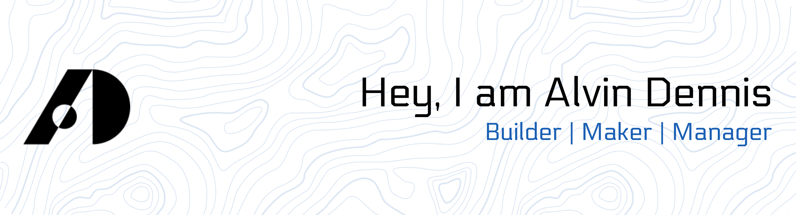
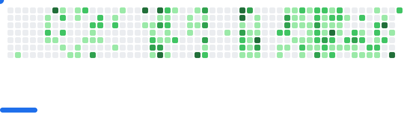

<div align="center">
<picture>
  <source
    media="(prefers-color-scheme: dark)"
    srcset="assets/banner-dark.png"
  />
  <source
    media="(prefers-color-scheme: light)"
    srcset="assets/banner-light.png"
  />
  
</picture>
</div>

<br/>

 <p align="center"><a href="https://github.com/alvin-dennis"></a></p>

###

<p align="center">
  <a href="https://alvindennis.tech/" target="_blank" style="text-decoration: none;">
    <button style="background-color: #0078D4; color: white; border: none; padding: 10px 20px; font-size: 16px; cursor: pointer;">Portfolio</button>
  </a>
  <span style="margin: 0 10px; font-size: 16px; color: #000;">|</span>
  <a href="https://resume.alvindennis.tech" target="_blank" style="text-decoration: none;">
    <button style="background-color: #FF6F61; color: white; border: none; padding: 10px 20px; font-size: 16px; cursor: pointer;">Resume</button>
  </a>
</p>

<p align="center">
  
</p>

<p align="center">
  <a href="https://discord.com/users/732503927940972605">
    <picture>
      <source alt="discord" media="(prefers-color-scheme: dark)" srcset="https://discord.c99.nl/widget/theme-3/732503927940972605.png" >
      
    </picture>
  </a>
</p>

<br>


<h3>About Me</h3>


 [](https://alvin-dennis.vercel.app)

 
  
 
 
 
 


<h3 align="left"> Socials</h3>
<p align="center">
<a href="https://linkedin.com/in/alvindennis/" target="blank"></a>
<a href="https://instagram.com/_a.lvin._" target="blank"></a>
</p>

<br>

</a>


<h3 align="left">Languages and Tools</h3>

<p align="center">
  <a href="https://skillicons.dev">
    
  </a>
</p>

</a>

<h3 align="left">Holopin Badges</h3>

[](https://holopin.io/@meteoricknight)


</a>

<div align="center">
<picture>
  <source
    media="(prefers-color-scheme: dark)"
    srcset="assets/breakout-dark.svg"
  />
  <source
    media="(prefers-color-scheme: light)"
    srcset="assets/breakout-light.svg"
  />
  
</picture>
</div>

</a>

<h3 align="left">Projects</h3>

<div align="center">
  <table>
    <tr>
      <td>
        <a href="https://github.com/alvin-dennis/EleGuard">
          
        </a>
      </td>
      <td>
        <a href="https://github.com/alvin-dennis/Beyond-Syllabus">
          
        </a>
      </td>
    </tr>
    <tr>
     <td>
        <a href="https://github.com/alvin-dennis/DropaLink">
          
        </a>
      </td>
      <td>
        <a href="https://github.com/alvin-dennis/alvin-dennis.github.io">
          
        </a>
      </td>
    </tr>
   <tr>
     <td>
        <a href="https://github.com/alvin-dennis/WaMate">
          
        </a>
      </td>
      <td>
        <a href="https://github.com/alvin-dennis/mulearnhome">
          
        </a>
      </td>
    </tr>
  </table>
</div>

</a>

<h3 align="left">GitHub Stats</h3>

</br>

<p align="center">
 
  <!--- stats (start) -->
<table align="center">
<tr border="none">
<td width="50%" align="center">
  
  
  <br></br>
  </a>
  <br></br>
  
</td>

<td width="50%" align="center">

  
  
  </td>
</tr>
</table>

<!--START_SECTION:waka-->

```txt
From: 09 May 2024 - To: 24 October 2025

Total Time: 639 hrs 23 mins

TypeScript           248 hrs 34 mins █████████▓░░░░░░░░░░░░░░░   38.52 %
JavaScript           115 hrs 31 mins ████▒░░░░░░░░░░░░░░░░░░░░   17.90 %
Python               51 hrs 26 mins  ██░░░░░░░░░░░░░░░░░░░░░░░   07.97 %
Astro                42 hrs 40 mins  █▓░░░░░░░░░░░░░░░░░░░░░░░   06.61 %
JSON                 40 hrs 42 mins  █▓░░░░░░░░░░░░░░░░░░░░░░░   06.31 %
```

<!--END_SECTION:waka-->

<p align="center"> <a href="https://github.com/ryo-ma/github-profile-trophy"></a> </p>

<div align="center">
  
</div>

<br>
 
 <div align="center">
 <p align="center"">

</p>


</a>

<br>

<div></div>
</div>
