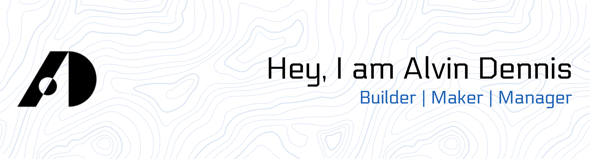
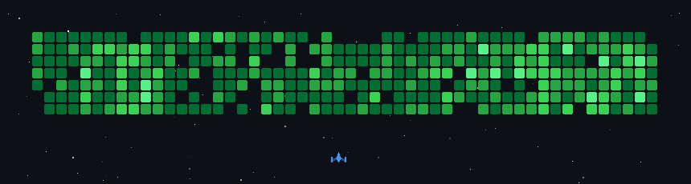

<div align="center">
<picture>
  <source
    media="(prefers-color-scheme: dark)"
    srcset="assets/banner-dark.png"
  />
  <source
    media="(prefers-color-scheme: light)"
    srcset="assets/banner-light.png"
  />
  
</picture>
</div>

<br/>

 <p align="center"><a href="https://github.com/alvin-dennis"></a></p>

###

<p align="center">
  <a href="https://alvinn.me/" target="_blank" style="text-decoration: none;">
    <button style="background-color: #0078D4; color: white; border: none; padding: 10px 20px; font-size: 16px; cursor: pointer;">Portfolio</button>
  </a>
  <span style="margin: 0 10px; font-size: 16px; color: #000;">|</span>
  <a href="https://resume.alvinn.me" target="_blank" style="text-decoration: none;">
    <button style="background-color: #FF6F61; color: white; border: none; padding: 10px 20px; font-size: 16px; cursor: pointer;">Resume</button>
  </a>
</p>

<p align="center">
  
</p>

<br>


<h3>About Me</h3>


 [](https://alvin-dennis.vercel.app)

 
  
 
 
 
 


<h3 align="left"> Socials</h3>
<p align="center">
<a href="https://linkedin.com/in/alvindennis/" target="blank"></a>
<a href="https://instagram.com/_a.lvin._" target="blank"></a>
</p>

<h3 align="left">Languages and Tools</h3>

<table align="center">
<tr width="50%">
<td valign="top" width="50%">

**Languages**
<p align="left">
  
</p>

**Frontend**
<p align="left">
  
</p>

**Docs**
<p align="left">
  
</p>

**Backend**
<p align="left">
  
</p>

</td>
<td valign="top" width="50%">

**Database / BaaS**
<p align="left">
  
</p>

**Deployment / Hosting**
<p align="left">
  
</p>

**DevOps / Tooling**
<p align="left">
  
</p>

**Hardware / Misc**
<p align="left">
  
</p>

</td>
</tr>
</table>

<h3 align="left">Holopin Badges</h3>

[](https://holopin.io/@meteoricknight)

<div align="center">

</div>

<h3 align="left">GitHub Stats</h3>
 
  <!--- stats (start) -->
<p align="center">
  
  
</p>
<!--START_SECTION:waka-->

```txt
From: 09 May 2024 - To: 16 August 2026

Total Time: 1,711 hrs 53 mins

TypeScript           1,181 hrs 25 mins     █████████████████░░░░░░░░   68.35 %
JavaScript           123 hrs 39 mins       █▓░░░░░░░░░░░░░░░░░░░░░░░   07.15 %
JSON                 66 hrs 1 min          █░░░░░░░░░░░░░░░░░░░░░░░░   03.82 %
Markdown             58 hrs 28 mins        █░░░░░░░░░░░░░░░░░░░░░░░░   03.38 %
Python               54 hrs 59 mins        ▓░░░░░░░░░░░░░░░░░░░░░░░░   03.18 %
```

<!--END_SECTION:waka-->

<div align="center">
  
</div>
