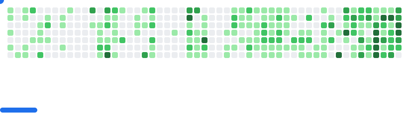

[](https://alvindennisv1.vercel.app/)
<h1 align="center">Hi 👋, I'm Alvin</h1>
<h3 align="center">A passionate  Frontend Web Developer and Tech Enthusiast from Kerala,India</h3>


 <p align="center"><a href="https://github.com/alvin-dennis/"></a></p>


###


<p align="center">
  <a href="https://alvindennis.tech/" target="_blank" style="text-decoration: none;">
    <button style="background-color: #0078D4; color: white; border: none; padding: 10px 20px; font-size: 16px; cursor: pointer;">Portfolio</button>
  </a>
  <span style="margin: 0 10px; font-size: 16px; color: #000;">|</span>
  <a href="https://resume.alvindennis.tech" target="_blank" style="text-decoration: none;">
    <button style="background-color: #FF6F61; color: white; border: none; padding: 10px 20px; font-size: 16px; cursor: pointer;">Resume</button>
  </a>
</p>


<br>
<!-- <style></style> -->


<b> About Me</b>


 [](https://alvin-dennis.vercel.app)

 
  
 
 
 
 


<h3 align="left"> Socials</h3>
<a href="https://linkedin.com/in/alvin-dennis-0a70ba163" target="blank"> <p align="center"> </a>
<a href="https://instagram.com/_a.lvin._" target="blank"></a>
</p>

<br>

</a>


<h2 align="left">Languages and Tools</h2>

<p align="center">
  <a href="https://skillicons.dev">
    
  </a>
</p>

</a>

<picture>
  <source
    media="(prefers-color-scheme: dark)"
    srcset="assets/breakout-dark.svg"
  />
  <source
    media="(prefers-color-scheme: light)"
    srcset="assets/breakout-light.svg"
  />
  
</picture>

</a>

## Projects

<details>
<summary>EleGuard</summary>

**Description:** Smart elephant monitoring system with real-time hazard detection and notification capabilities.  
**Technologies:** `Python` | `Raspberry Pi` | `Roboflow` | `OpenCV` | `Twilio`  
**Highlights:** Designed and built an IoT-based elephant monitoring system that detects elephants and alerts people in real-time using computer vision and machine learning techniques, enhancing wildlife safety and community awareness.  
[GitHub Repo](https://github.com/alvin-dennis/EleGuard) 

</details>

<details>
<summary>Git Time Machine</summary>

**Description:** Interactive visualization platform for Git repository analysis that provides chronological mapping of project history.  
**Technologies:** `HTML` | `Tailwind CSS` | `JavaScript` | `NPM` | `GitHub API`  
**Highlights:** Implemented a repository visualization application leveraging GitHub API integration that presents commit history through an interactive timeline interface, facilitating efficient codebase evolution analysis.  
[GitHub Repo](https://github.com/vHackBots/Git-Time-Machine) | [Live Demo](https://www.npmjs.com/package/git-tm)

</details>

<details>
<summary>Personal Portfolio</summary>

**Description:** Professional developer portfolio utilizing modern bento grid layout with responsive design and accessibility features.  
**Technologies:** `Nextjs` | `Tailwind CSS` | `Shadcn` | `TypeScript`  
**Highlights:** Engineered a responsive TypeScript-based Next.js application featuring theme customization, component-based architecture, and optimized performance metrics to effectively showcase technical expertise and project accomplishments.  
[GitHub Repo](https://github.com/alvin-dennis/Personal-Portfolio-2.0) | [Live Demo](https://alvindennis.tech/)

</details>

<details>
<summary>DevMate</summary>

**Description:** DevMate is a chatbot that assists developers in finding the code they need.  
**Technologies:** `Python` | `Pathway` | `OpenAI` | `Streamlit`  
**Highlights:** Built an AI-powered coding assistant that integrates OpenAI's language models with a custom interface to provide contextualized code suggestions and explanations.  
[GitHub Repo](https://github.com/alvin-dennis/DevMate) 

</details>

<details>
<summary>Website Status Checker</summary>

**Description:** This is a Python application to check the status of websites.  
**Technologies:** `Python` | `Streamlit` | `Lighthouse API`  
**Highlights:** Created a monitoring tool that performs real-time website status checks with performance metrics visualization using Lighthouse API integration.  
[GitHub Repo](https://github.com/alvin-dennis/Website-Status-Checker) 

</details>

</a>


<h3 align="left">GitHub Stats</h3>

</br>

<p align="center">
 
  <!--- stats (start) -->
<table align="center">
<tr border="none">
<td width="50%" align="center">
  
  
  <br></br>
   
</td>

<td width="50%" align="center">

  
  
  </td>
</tr>
</table>

<!--START_SECTION:waka-->

```txt
From: 09 May 2024 - To: 22 August 2025

Total Time: 452 hrs 7 mins

TypeScript           116 hrs 34 mins ██████▒░░░░░░░░░░░░░░░░░░   25.50 %
JavaScript           108 hrs 14 mins ██████░░░░░░░░░░░░░░░░░░░   23.68 %
Python               51 hrs 18 mins  ██▓░░░░░░░░░░░░░░░░░░░░░░   11.22 %
HTML                 30 hrs 19 mins  █▓░░░░░░░░░░░░░░░░░░░░░░░   06.63 %
JSON                 30 hrs 2 mins   █▓░░░░░░░░░░░░░░░░░░░░░░░   06.57 %
```

<!--END_SECTION:waka-->

<p align="center"> <a href="https://github.com/ryo-ma/github-profile-trophy"></a> </p>

<div align="center">
  
</div>


 
<br>
 
 <div align="center">
 <p align="center"">

</p>


</a>

<br>

<div></div>
</div>
